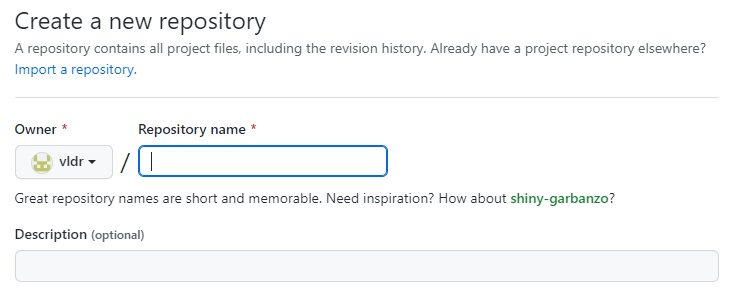
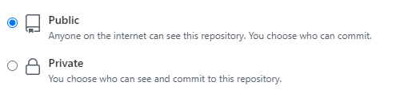
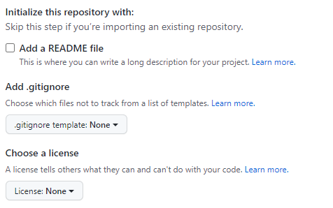
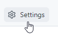
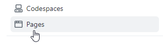
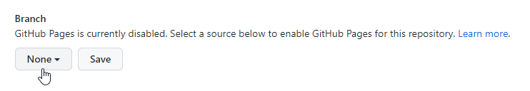
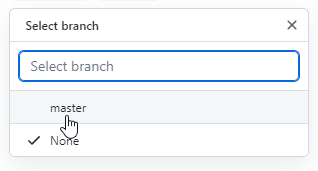
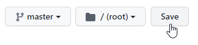
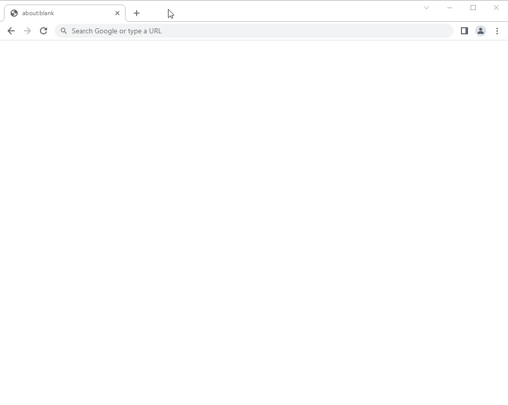

# Hosting a Resumé

## Table of Contents

- [Table of Contents](#table-of-contents)
- [Purpose](#purpose)
- [Prerequisites](#prerequisites)
- [Creating a GitHub Repository](#creating-a-github-repository)
- [Setting Up Jekyll](#setting-up-jekyll)
- [Formatting and Publishing Your Resumé](#formatting-and-publishing-your-resumé)
- [Editing Your Resumé](#editing-your-resumé)
- [More Resources](#more-resources)
- [Authors and Acknowledgments](#authors-and-acknowledgments)
- [Frequently Asked Questions](#frequently-asked-questions)
  - [Why is Markdown better than a word processor?](#why-is-markdown-better-than-a-word-processor)
  - [Why am I getting a "There isn't a GitHub Pages site here" error message when visiting my published GitHub Pages site?](#why-am-i-getting-a-there-isnt-a-github-pages-site-here-error-message-when-visiting-my-published-github-pages-site)
  - [Can I use a different name other than \<username\>.github.io for my GitHub repository's name?](#can-i-use-a-different-name-other-than-usernamegithubio-for-my-github-repositorys-name)

## Purpose

This tutorial will explain how you can format and host your resumé on [GitHub Pages] using tools like [Git], [Jekyll] and [Visual Studio Code]. Additionally, this tutorial will try to relate the general principles of current technical writing in each step of the instructions, as described in Andrew Etter's book [Modern Technical Writing].

## Prerequisites

Before you venture forth into this tutorial, there are some things you're expected to have:

1. A resumé that is written in Markdown.
2. A [GitHub] account.
3. [Visual Studio Code] installed on your machine.
4. [Git] installed on your machine.
5. The latest version of [Ruby] and [Jekyll] installed on your machine.

## Creating a GitHub Repository

An important principle of modern technical writing, according to Andrew Etter, is using a distributed version control system (DVCS) for storing documentation. A distributed version control system is a tool that keeps track of changes made to files.

In your case, you'll be using [Git] as your distributed version control system to store your resumé in a Git repository. A Git repository is like a folder on your computer that can store and organize your files. But, unlike a folder, a Git repository can store different versions of your files. Whenever you make a change to a file (called a _commit_), a new version of that file is created. This allows you to go back in time and see the changes you've made to each file in your repository.

In addition to Git, you'll be using [GitHub]. GitHub is a website that stores your Git repository _remotely_ on GitHub's servers. Whenever you commit changes to your Git repository, you're only making a local copy of those changes on your machine. To have those changes appear on your GitHub repository, you'll need to upload those changes to GitHub (called a _push_). You can think of your GitHub repository as the remote copy of your local Git repository.

The reason why you're storing your Git repository on GitHub is that GitHub can display your Git repository's files as a website through a feature called [GitHub Pages].

So, now that you understand what GitHub and a Git repository are, you can go ahead and create a new GitHub repository:

1. Go to [https://github.com/new](https://github.com/new)

2. Type `<username>.github.io` as the name of your repository (and, optionally a description as well).

   Replace `<username>` with your GitHub account username.

   
   _Diagram 1. A picture of two input boxes prompting the user to enter a name and description for their repository._

3. Select **Public** as your repository's visibility.

   Your repository must be public so that when you host your resumé on GitHub Pages everyone will be able to access your resumé's website.

     
   _Diagram 2. A picture of two radio buttons prompting the user to choose between a public or private-facing repository._

4. Leave the "initialize this repository with" options blank.

     
   _Diagram 3. A picture of various options that need to be ignored._

5. Click the **Create Repository** button.

     
   _Diagram 4. A picture of a mouse cursor hovering over the Create Repository button._

Congratulations! 🎉 You now have an empty GitHub repository.

The next step is getting your GitHub repository set up on your local machine, and setting up a tool called [Jekyll] which will convert your resumé's Markdown code into website-compatible HTML and CSS files.

## Setting Up Jekyll

Another important principle of modern technical writing, according to Andrew Etter, is that documentation should live on a static website, not a PDF.

In your case, your resumé will live as a static website on GitHub Pages. But, for GitHub Pages to be able to display your website, you need to use a static site generator tool called [Jekyll]. Jekyll will convert your resumé's Markdown code into a collection of HTML and CSS files that GitHub Pages can understand.

Because Jekyll can be quite difficult to work with, this tutorial will provide you with a ready-to-go resumé Jekyll template that you will be able to download and use without much hassle.

So, now that you understand what Jekyll is, you can go ahead and begin setting up Jekyll:

1. Open a command-line terminal.
2. Download your GitHub repository onto your local machine:

   `git clone https://github.com/<username>/<username>.github.io`

   Replace `<username>` with your GitHub account username.

3. Navigate to your Git repository directory:

   `cd <username>.github.io`

4. Download the ready-to-go resumé Jekyll template [ZIP file] into your directory.

5. Unpack the contents of that ZIP file into your directory.

6. Delete the ZIP file.

7. Initialize the Jekyll template:

   `bundle install`

Congratulations! 🎉 You now have Jekyll set up on your machine.

The next step is formatting your resumé to work with Jekyll and publishing your resumé on GitHub Pages.

## Formatting and Publishing Your Resumé

According to Andrew Etter, an important principle of modern technical writing is that you, as a technical writer, should publish frequently. In your case, whenever you make a change to your resumé, that change should be reflected immediately on your resumé's website.

To achieve that, you first need to format your resumé to work with Jekyll, then you need to upload your Git repository's files to your remote GitHub repository and enable GitHub Pages:

1. Open a command-line terminal.
2. Navigate to your Git repository's directory on your machine.
3. Start up Jekyll:

   `bundle exec jekyll serve`

4. Open `index.md` in Visual Studio Code.

   The `index.md` file should be inside your Git repository's directory.

5. Format your resumé by pasting its Markdown code on line 5 inside of `index.md`.
6. Save the file.
7. Navigate to the URL: [http://localhost:4000/](http://localhost:4000/)

   You should see your resumé's content appear as a website.

8. Go back to your command-line terminal.

9. Shut down Jekyll by pressing **Control + C** on your keyboard.

10. Add all the files in your Git repository's directory to Git's staging area:

    `git add .`

    This tells Git exactly what you changed, which in your case, you're telling Git that you added the Jekyll template files from before and modified the `index.md` file.

11. Commit your changes to your Git repository:

    `git commit -m "<message>"`

    Replace `<message>` with a [descriptive and meaningful] commit message that describes what you changed. In this case, a good message would be: "Add and format resumé."

    By committing your changes, you're telling Git that it should store the changes you've made as a new point in its history.

12. Upload your Git repository's changes to GitHub:  
    `git push`

13. Navigate to the URL: `https://github.com/<username>/<username>.github.io`

    Replace `<username>` with your GitHub account username.

14. Click on the **Settings** navigation button in the top portion of the page.

      
    _Diagram 5. A picture of a mouse cursor hovering over a button labelled "Settings."_

15. Click on the **Pages** navigation button in the left portion of the page.

      
    _Diagram 6. A picture of a mouse cursor hovering over a button labelled "Pages."_

16. Click on the **None** dropdown button to open a list of options.

      
    _Diagram 7. A picture of a mouse cursor hovering over a dropdown button labelled "None."_

17. Select **master** (or **main**) from the dropdown list.

      
    _Diagram 8. A picture of a mouse cursor hovering over a dropdown list menu labelled "master."_

18. Click the **Save** button.

      
    _Diagram 9. A picture of a mouse cursor hovering over a button labelled "Save."_

19. Navigate to the URL: `https://<username>.github.io`

    Replace `<username>` with your GitHub account username.

    Once you navigate to the URL, you should see your published resumé's website. If you see a "There isn't a GitHub Pages site here" error message, then you will likely need to wait a bit, as the publishing process for GitHub Pages takes some time.

Congratulations! 🎉 You have now formatted your resumé to work with Jekyll and you have published your resumé as a website on GitHub Pages!

The next step is learning how you can combine everything you've just learned to make edits to your resumé and have those edits appear on GitHub Pages.

## Editing Your Resumé

To recap, according to Andrew Etter, you've learned about three important principles of modern technical writing: Use a distributed version control system (DVCS) for tracking changes made to your resumé, host your resumé as a static webpage rather than a PDF, and publish the changes you've made to your resumé frequently.

Now, you will combine all three principles to make edits to your resumé:

1. Open a command-line terminal.

2. Navigate to your Git repository's directory.

3. Start up Jekyll:

   `bundle exec jekyll serve`

4. Open `index.md` in Visual Studio Code.

5. Make any necessary changes to your resumé.

6. Save your file.

7. Navigate to [http://localhost:4000/](http://localhost:4000/) to view the changes you've made.

8. Repeat steps 5 &mdash; 7 until you're finished making changes.

9. Go back to your command-line terminal.

10. Shut down Jekyll by pressing **Control + C** on your keyboard.

11. Add all the files in your Git repository's directory to Git's staging area:

    `git add .`

12. Commit your changes to your Git repository:

    `git commit -m "<message>"`

    Replace `<message>` with a [descriptive and meaningful] commit message that describes what you changed. In this case, a good message would be something like: "Update my contact information."

13. Upload your Git repository's files to GitHub:  
    `git push`

14. Navigate to the URL: `https://<username>.github.io`

    Replace `<username>` with your GitHub account username.

Congratulations! 🎉 You have combined all the things you've learned so far to update your resumé using Visual Studio Code, commit the changes you've made to Git, upload those changes to GitHub, and publish your newly updated resumé to GitHub Pages for everyone to see.

You have now completed this tutorial, and your resumé's website should look similar to what is being shown in Diagram 10. If you've faced problems along the way, refer to the [Frequently Asked Questions](#frequently-asked-questions) section which may have answers to some of your problems.

_Diagram 10. An animated picture showing off a resumé hosted on GitHub Pages._

## More Resources

Here are some additional resources you can refer to:

- A [Markdown tutorial] which can help you quickly learn about Markdown.
- Andrew Etter's book [Modern Technical Writing].
- University of Manitoba's Career Services [Resumé Workbook] which can help you create a good resumé.

## Authors and Acknowledgments

I'd like to thank the creators of the Jekyll template, [Minima], who enabled me to create a modified resumé template on top of their Minima template for this tutorial. Finally, I want to thank my group members who helped me gain a better understanding of Jekyll and GitHub Pages.

## Frequently Asked Questions

### Why is Markdown better than a word processor?

Markdown is better than a word processor because, unlike a typical word processor, Markdown is everywhere&mdash;you can find Markdown in [GitHub], [Discord], [Reddit], and many other applications. Markdown is a lot more simple to learn than most word processors. Most word processors can only export to PDFs, whereas Markdown documents can be exported to PDFs, presentation slides, websites, etc.

### Why am I getting a "There isn't a GitHub Pages site here" error message when visiting my published GitHub Pages site?

The most common reason why you're experiencing that error message is that GitHub Pages has yet to update their servers with your resumé. So, the solution is to just wait a bit for it to fully load.

### Can I use a different name other than `<username>.github.io` for my GitHub repository's name?

Yes, you can. But, be wary that some commands in this tutorial would need to be modified to accommodate for the different GitHub repository name, and understand that your resumé's website will now only be accessible through the URL: `https://<username>.github.io/<repository name>`

[descriptive and meaningful]: https://cbea.ms/git-commit/
[bundler]: https://bundler.io/
[zip file]: files/jekyll-template.zip
[ruby]: https://www.ruby-lang.org/en/
[github]: https://github.com/
[github pages]: https://pages.github.com/
[markdown]: https://en.wikipedia.org/wiki/Markdown
[jekyll]: https://jekyllrb.com/
[visual studio code]: https://code.visualstudio.com/
[git]: https://git-scm.com/
[modern technical writing]: https://www.amazon.ca/Modern-Technical-Writing-Introduction-Documentation-ebook/dp/B01A2QL9SS
[github flavored markdown]: https://www.markdowntutorial.com/
[markdown tutorial]: https://www.markdowntutorial.com/
[resumé workbook]: https://umanitoba.ca/student/careerservices/media/Resume.pdf
[discord]: https://support.discord.com/hc/en-us/articles/210298617-Markdown-Text-101-Chat-Formatting-Bold-Italic-Underline-
[reddit]: https://www.reddit.com/wiki/markdown/
[minima]: https://github.com/jekyll/minima
